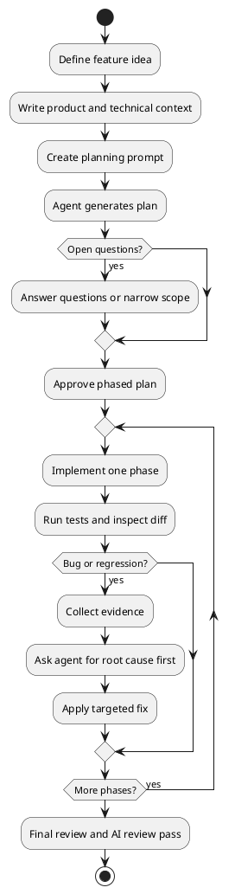

# AI Coding Workflow

A controlled AI coding workflow reduces hallucination and keeps agent work aligned with the existing codebase.

## Workflow

| Step | Output | Why it matters |
|---|---|---|
| Define the idea | Clear feature scope and non-goals | Prevents vague prompts and accidental scope expansion. |
| Document product context | PRD or codebase brief | Gives the agent the product, users, flows, constraints, and stack. |
| Create a high-quality prompt | Implementation-planning prompt | Makes the next planning step specific and auditable. |
| Generate a plan | Phased implementation plan with risks | Surfaces assumptions before code changes. |
| Break work into phases | Small, bounded tasks | Reduces context overload and makes review easier. |
| Implement | Focused diffs | Keeps changes tied to the plan. |
| Test and review | Test results, manual verification, diff review | Finds regressions before shipping. |
| Debug from evidence | Root cause explanation before fixes | Avoids random changes. |
| Use AI review tools | Additional review pass | Catches issues missed during manual review. |

## Feature Definition Questions

- Who needs this?
- What is painful or missing today?
- What is the simplest useful version?
- What belongs in V1 versus later?
- How does it fit existing billing, permissions, UI, data, and architecture?
- What does success look like from the user's perspective?
- What is explicitly out of scope?

## PRD Checklist

- Target users
- MVP scope
- Primary user flow
- Key features
- Functional requirements
- Technical stack and constraints
- Existing codebase conventions
- Non-goals

## Agent Prompt Template

```text
You are working in an existing codebase.

Goal:
<describe the feature>

Product context:
<summarize users, workflows, constraints, and success criteria>

Technical context:
<frameworks, libraries, data model, auth, billing, tests, style rules>

Scope:
- In scope: <items>
- Out of scope: <items>

Task:
Generate an implementation plan only. Do not edit files yet.
Identify files likely to change, risks, open questions, test plan, and a phased implementation sequence.
```

## Debug Prompt Template

```text
Here is the observed behavior:
<what happened>

Expected behavior:
<what should happen>

Evidence:
<logs, stack traces, screenshots, failing test output>

Task:
Find the likely root cause and explain it. Do not fix yet.
List the smallest code change that would address the cause and how to verify it.
```

## Agent Workflow Diagram



## Notes

- Do not treat model rankings as durable knowledge. Model quality, pricing, and tool capabilities change quickly.
- Stable project instructions are valuable. Cursor rules, Codex `AGENTS.md`, and similar files act as persistent project context for AI coding sessions.
- Prefer small requests over large one-shot feature builds.
- Ask for analysis before fixes when debugging important failures.

## Sources

- [[sources/How Senior Developers Actually Code With AI]]
- [Cursor Rules](https://docs.cursor.com/en/context/rules)
- [Cursor Agent overview](https://docs.cursor.com/context/management)
