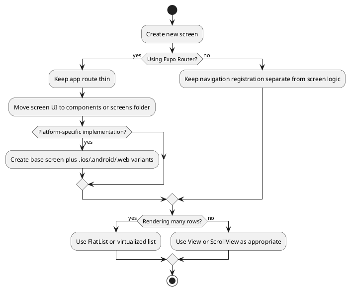

# React Native App Structure and Core Components

Small component choices and route organization decisions compound quickly in React Native apps.

## Recommendations

| Area | Prefer | Avoid when possible | Reason |
|---|---|---|---|
| Touch handling | `Pressable` | `TouchableOpacity` for new components | `Pressable` supports richer press states and events. |
| Platform differences | `.ios.tsx`, `.android.tsx`, `.native.tsx`, `.web.tsx` files | Large inline `Platform.OS` branches | Keeps platform-specific code isolated and easier to test. |
| Large lists | `FlatList` or another virtualized list | `ScrollView` with many API-driven rows | `ScrollView` renders all children at once. |
| Static short content | `ScrollView` | Over-engineered list setup | Simple static screens do not need virtualization. |
| Expo Router routes | Thin route files that export screens | Heavy data fetching and UI logic directly inside `app/` | Makes navigation refactors easier. |
| Safe areas | `react-native-safe-area-context`; iOS scroll inset behavior where appropriate | Core `SafeAreaView` as a default | Core `SafeAreaView` is deprecated. |

## Pressable Example

```tsx
import { Pressable, Text } from 'react-native';

export function PrimaryButton({ onPress }: { onPress: () => void }) {
  return (
    <Pressable
      onPress={onPress}
      style={({ pressed }) => ({
        opacity: pressed ? 0.72 : 1,
        transform: [{ scale: pressed ? 0.98 : 1 }],
      })}
    >
      <Text>Continue</Text>
    </Pressable>
  );
}
```

## Expo Router Platform Files

In Expo Router, platform-specific route files inside `app` or `src/app` require a non-platform base route file too.

```text
app/
  profile.tsx
  profile.ios.tsx
```

For deeper native differences, keep route files thin and put platform implementations outside `app`:

```text
app/
  profile.tsx
components/
  profile-screen.tsx
  profile-screen.ios.tsx
```

```tsx
// app/profile.tsx
export { default } from '../components/profile-screen';
```

## List Choice

```tsx
import { FlatList, Text } from 'react-native';

export function ResultsList({ items }: { items: Array<{ id: string; title: string }> }) {
  return (
    <FlatList
      data={items}
      keyExtractor={(item) => item.id}
      renderItem={({ item }) => <Text>{item.title}</Text>}
      ListEmptyComponent={<Text>No results yet.</Text>}
      contentInsetAdjustmentBehavior="automatic"
    />
  );
}
```

## Route Organization Flow



## Sources

- [[sources/Top 6 React Native Tips to Survive 2026]]
- [React Native TouchableOpacity](https://reactnative.dev/docs/touchableopacity.html)
- [React Native Pressable](https://reactnative.dev/docs/pressable)
- [React Native ScrollView](https://reactnative.dev/docs/scrollview)
- [React Native FlatList](https://reactnative.dev/docs/flatlist)
- [React Native SafeAreaView](https://reactnative.dev/docs/SafeAreaView)
- [Expo Router platform-specific extensions](https://docs.expo.dev/router/advanced/platform-specific-modules/)
