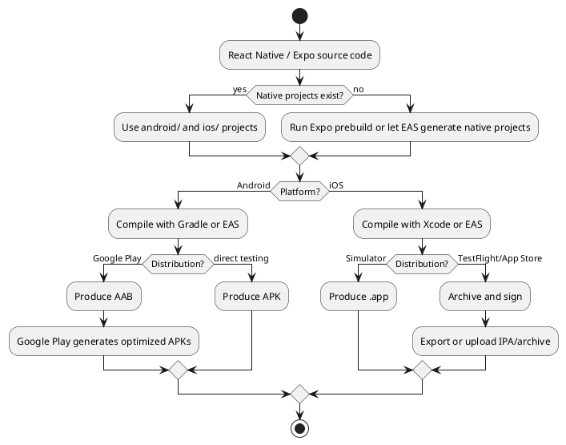

# Build Artifacts and Release Builds

React Native apps produce native mobile artifacts. The artifact you need depends on the platform, target environment, and distribution path.

## Artifact Comparison

| Artifact | Platform | Primary use | Install target | Notes |
|---|---|---|---|---|
| APK | Android | Direct install, internal sharing, some non-Play distribution | Android device or emulator | Good for quick install testing. Google Play generally expects AAB for new apps. |
| AAB | Android | Google Play publishing | Google Play generates device-specific APKs | Publishing format, not usually installed directly by users. |
| `.app` | iOS | Simulator builds and local Xcode output | iOS simulator, or device depending on signing/build settings | Useful for simulator testing and E2E tests. |
| IPA | iOS | TestFlight, App Store, ad hoc distribution | Real iOS devices | Signed distributable package produced from an archived app. |

## Build Paths

| Path | Android | iOS | Best for |
|---|---|---|---|
| Native local build | Gradle / Android Studio | Xcode / `xcodebuild` | Fast local iteration when toolchains are installed. |
| EAS local build | `eas build --platform android --local` | `eas build --platform ios --local` | Debugging cloud build failures or using EAS conventions locally. |
| EAS cloud build | `eas build --platform android` | `eas build --platform ios` | Team workflows, CI, consistent hosted build environments, iOS builds from non-Mac machines. |

## Expo Prebuild

Expo prebuild generates native project directories from app configuration:

```bash
npx expo prebuild
```

After prebuild, Android builds use the generated `android/` project and iOS builds use the generated `ios/` project. If a project relies on Continuous Native Generation, prefer config plugins over manual edits to generated native files.

## Android Commands

For a React Native app, the current React Native publishing guide documents:

```bash
npx react-native build-android --mode=release
```

This uses Gradle `bundleRelease` under the hood and writes an AAB to:

```text
android/app/build/outputs/bundle/release/app-release.aab
```

For Expo/EAS cloud builds:

```bash
eas build --platform android
```

For EAS local builds:

```bash
eas build --platform android --local
```

## iOS Commands

Local iOS builds require Xcode on macOS. For Expo/EAS cloud builds:

```bash
eas build --platform ios
```

For EAS local builds:

```bash
eas build --platform ios --local
```

For App Store or TestFlight distribution, use Xcode to archive the app, then distribute the archive through Organizer.

## Build Lifecycle



## Practical Rules

- Use APKs for quick Android install testing.
- Use AABs for Google Play publishing.
- Use `.app` builds for iOS simulator workflows and E2E testing.
- Use signed IPA/archive workflows for TestFlight and App Store distribution.
- Use EAS cloud builds when you need a hosted macOS environment, team consistency, or CI-friendly build automation.
- Use EAS local builds to reproduce EAS build behavior locally, but account for the documented local-build limitations.

## Sources

- [[sources/How React Native Builds Actually Work]]
- [Expo EAS Build](https://docs.expo.dev/build/introduction/)
- [Expo local EAS builds](https://docs.expo.dev/build-reference/local-builds/)
- [Expo prebuild](https://docs.expo.dev/workflow/prebuild)
- [React Native publishing to Google Play](https://reactnative.dev/docs/signed-apk-android.html)
- [Android App Bundles](https://developer.android.google.cn/guide/app-bundle?hl=en)
- [Apple app distribution](https://developer.apple.com/documentation/Xcode/distributing-your-app-for-beta-testing-and-releases)
