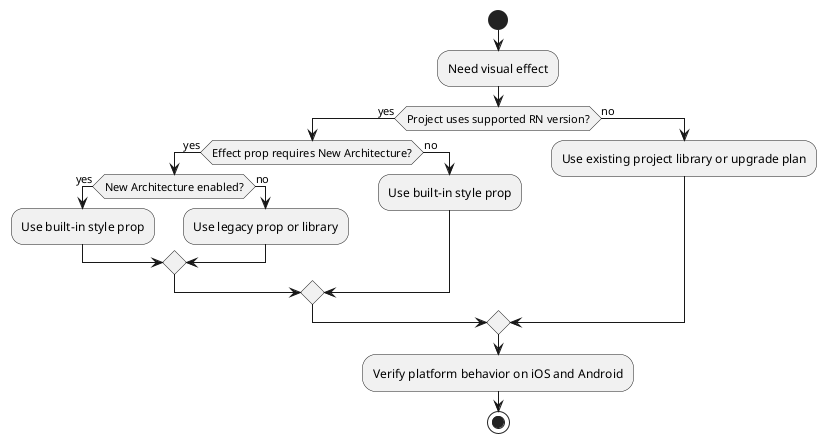

# Modern React Native Style Props

React Native has moved closer to web-style syntax for several UI effects. These props can reduce third-party dependencies, but many of them require the New Architecture or have platform limits.

## Quick Reference

| Prop | Use case | Current caveats |
|---|---|---|
| `backgroundImage` | CSS-like background images and gradients | Experimental; verify support in the project's React Native version. |
| `filter` | Blur, brightness, opacity, saturation, invert, graphical filters | New Architecture-only from React Native 0.76. iOS supports brightness and opacity; Android has broader support, with Android version limits for some effects. |
| `boxShadow` | CSS-like one-line shadows, including multi-layer shadows | New Architecture-only. Outset shadows require Android 9+; inset shadows require Android 10+. |
| `gap`, `rowGap`, `columnGap` | Spacing between flex children | Official flexbox props; only pixel units are supported. |
| `mixBlendMode` | Blend a view with its stacking context | New Architecture-only and Android 10+. |

## Examples

```tsx
import { View } from 'react-native';

export function ModernStylesExample() {
  return (
    <View style={{ gap: 16 }}>
      <View
        style={{
          width: 160,
          height: 96,
          borderRadius: 16,
          backgroundImage: 'linear-gradient(135deg, #2563eb, #22c55e)',
        }}
      />

      <View
        style={{
          width: 160,
          height: 96,
          borderRadius: 16,
          backgroundColor: '#fff',
          boxShadow: '0px 8px 24px rgba(15, 23, 42, 0.18)',
        }}
      />

      <View
        style={{
          width: 160,
          height: 96,
          backgroundColor: '#f97316',
          mixBlendMode: 'multiply',
        }}
      />
    </View>
  );
}
```

Use older platform-specific shadow props only when the project cannot rely on New Architecture support or when you need broader legacy compatibility.

## Decision Flow



## Practical Rules

- Prefer `gap` over child margins for simple flex spacing.
- Prefer `boxShadow` for modern, web-like shadows when New Architecture support is available.
- Do not assume `filter` works the same on iOS and Android.
- Do not add a gradient or shadow library until checking whether built-in props cover the target platform matrix.
- Keep fallbacks explicit when a style prop only works on one platform or OS range.

## Sources

- [[sources/Stop Writing React Native Styles Like It's 2022]]
- [React Native 0.76 release notes](https://reactnative.dev/blog/2024/10/23/release-0.76-new-architecture)
- [React Native View Style Props](https://reactnative.dev/docs/view-style-props)
- [React Native Flexbox](https://reactnative.dev/docs/flexbox)
