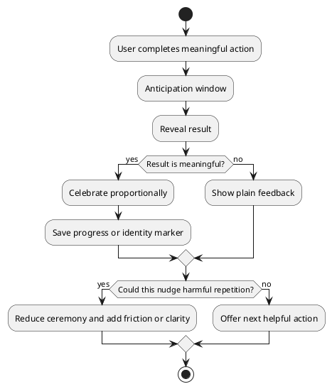

# Habit Loops and Reward Systems

Retention mechanics should help users build useful habits, not trap them. Use these patterns to make meaningful progress visible and memorable, with clear ethical constraints.

## Core Patterns

| Pattern | Mechanism | Useful version | Risky version |
|---|---|---|---|
| Controlled surprise | Occasional unexpected reward inside a predictable system | Bonus insight, delightful milestone, varied learning prompt | Slot-machine-like compulsion with unclear odds |
| Infinite game | Progression that continues beyond one completion point | Long-term skill growth, fitness history, learning streaks | Never-ending pressure with no healthy stopping point |
| Visible status | Social comparison and identity | Voluntary sharing, team accountability, community recognition | Public shame, coercive leaderboards, social pressure |
| Reward ceremony | Anticipation, reveal, afterglow | Celebrating meaningful achievements | Over-celebrating harmful or high-risk actions |

## Three-Stage Reward Sequence

1. Anticipation: signal that something meaningful is about to happen.
2. Reveal: present the result with enough visual, haptic, or motion weight to make it legible.
3. Afterglow: let the result breathe through a shareable card, saved milestone, reflection, or next-step prompt.

## Ethical Guardrails

- Do not hide costs, odds, cancellation paths, or consequences.
- Do not use celebratory design to trivialize risky financial, health, privacy, or safety decisions.
- Make streak recovery humane; avoid turning one missed day into punishment.
- Let users opt out of social visibility.
- Prefer progress toward user goals over engagement for its own sake.
- Use friction when the action has real-world downside.

## Product Checklist

| Question | Good answer |
|---|---|
| What user goal does this habit serve? | A goal the user would still endorse after reflection. |
| What is the smallest honest reward? | Feedback proportionate to the action's value. |
| Is the reward transparent? | Users understand what happened and why. |
| Can users stop without penalty? | Leaving does not destroy disproportionate value or identity. |
| Is social pressure optional? | Users control what is shared and where. |

## Sources

- [[sources/How To Scientifically Design Addictive Apps]]
- [[sources/The 3-Stage Trick Behind Every Addictive App]]
- [FTC dark patterns report](https://www.ftc.gov/node/79647)
- [ProductPlan Hook Model glossary](https://www.productplan.com/glossary/hook-model/)
- [Hooked by Nir Eyal](https://www.penguin.co.uk/books/278201/hooked-by-eyal-nir/9780241246962)
